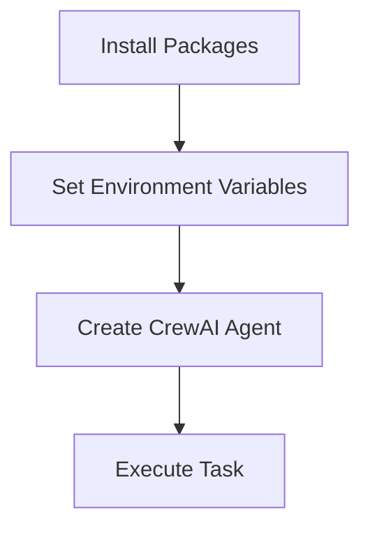
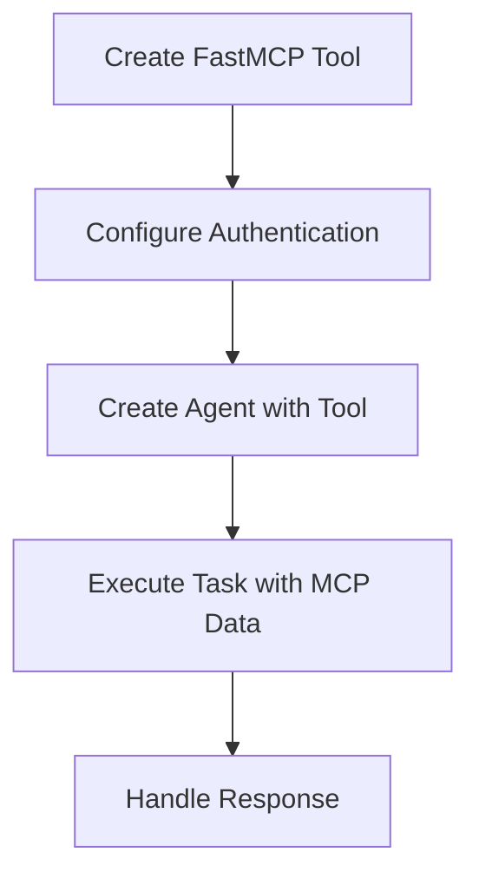
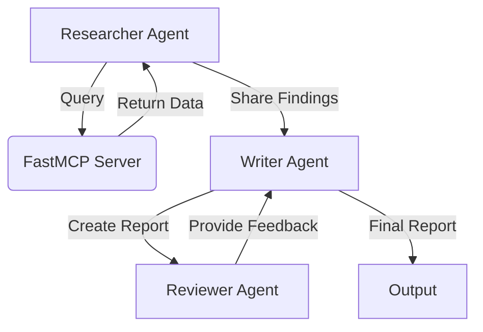

# CrewAI with FastMCP Server Integration Course

This course teaches beginners how to use CrewAI with FastMCP server access through step-by-step programming examples.

## Course Overview

This course is designed for beginner developers with basic Python knowledge who want to learn how to integrate CrewAI agents with FastMCP servers. The course covers fundamental concepts, practical implementation, and advanced patterns for building intelligent agent workflows.

## Lessons

### Lesson 1: Setting up CrewAI with MCP Server Access
- Install required packages
- Set up environment variables
- Create a basic CrewAI agent
- Execute simple tasks



### Lesson 2: Integrating MCP Server with CrewAI
- Create custom tools for MCP server access
- Configure authentication and connection settings
- Use MCP server data in agent tasks
- Handle errors and exceptions



### Lesson 3: Advanced CrewAI Patterns with MCP Server
- Implement multi-agent workflows
- Use hierarchical processes
- Share data between agents through the MCP server
- Store and retrieve research findings
- Implement quality assurance processes



## Getting Started

### Using pip (traditional method)

1. Install the required packages:
```bash
pip install -r requirements.txt
```

2. Set up your environment variables:
```bash
export FASTMCP_URL=http://your-fastmcp-server-url:port
export FASTMCP_API_KEY=your-api-key
```

3. Run the examples:
```bash
python lesson1_setup.py
python lesson2_mcp_integration.py
python lesson3_advanced_patterns.py
```

### Using uv (recommended modern method)

[uv](https://github.com/astral-sh/uv) is a fast Python package installer and resolver. To use uv:

1. Install uv:
```bash
pip install uv
```

2. Create and activate a virtual environment:
```bash
uv venv
source .venv/Scripts/activate
```

3. Install dependencies:
```bash
uv pip install -r requirements.txt
```

4. Set up your environment variables:
```bash
export FASTMCP_URL=http://your-fastmcp-server-url:port
export FASTMCP_API_KEY=your-api-key
```

5. Run the examples:
```bash
python lesson1_setup.py
python lesson2_mcp_integration.py
python lesson3_advanced_patterns.py
```

## Requirements

- Python 3.8+
- CrewAI library
- FastMCP library
- Access to an MCP server

## Course Structure

Each lesson includes:
- A Python script with comprehensive comments
- Clear objectives and expected outcomes
- Step-by-step implementation
- Best practices for error handling and security

## Next Steps

After completing this course, you should be able to:
- Create and configure CrewAI agents
- Integrate MCP servers with agent workflows
- Build complex multi-agent systems
- Implement data sharing between agents
- Design robust error handling for production systems